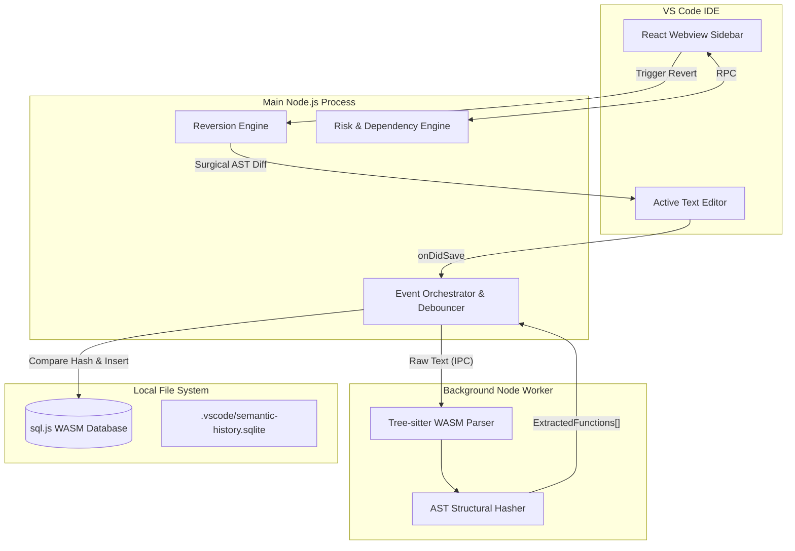

# ⏳ FuncUndo: The Semantic Code Time Machine


### *Stop undoing files. Start reverting logic.*

**FuncUndo** (internally *Chronos*) is a function-level version control system for VS Code. While Git tracks raw text lines, FuncUndo understands **Abstract Syntax Trees (AST)**. It tracks changes to your logic blocks silently in the background, allowing you to "time travel" individual functions without affecting the rest of your file.

---

## 🧐 Why FuncUndo?

Git is a blunt instrument for local, exploratory coding. When you’re deep in a "flow state," you don't want to commit every 2 minutes, but you also don't want to lose that brilliant version of a function you wrote an hour ago.

| Feature | Git / Standard Undo | **FuncUndo** |
| --- | --- | --- |
| **Granularity** | File or Line-level | **Function & Method-level** |
| **Context** | Raw text differences | **Semantic logic changes** |
| **Safety** | Blind reversion | **Dependency risk assessment** |
| **Noise** | Tracks whitespace/formatting | **Ignores non-logic changes** |

---

## ✨ Key Superpowers

* **🧠 AST-Aware Tracking:** Hashes code based on structural logic. If you only changed a comment or added whitespace, FuncUndo knows the logic is the same and won't clutter your history.
* **🕸️ The Risk Engine:** Features a real-time Directed Acyclic Graph (DAG) of your call stack. It warns you before a revert if the change will break active dependent functions.
* **🔒 100% Local & Private:** Your code never leaves your machine. History is stored in a high-performance SQLite WASM binary within your workspace.
* **⚡ Zero-Lag Architecture:** Heavy lifting is offloaded to Node.js Worker Threads. Your VS Code UI stays at a flawless 60fps while we parse your AST in the background.
* **🌐 WASM-Powered:** Built on `web-tree-sitter` and `sql.js` for zero native dependencies. It works out-of-the-box on Windows, Mac, Linux, and even VS Code for the Web.

---

## 🏗 System Architecture

We strictly decouple the **Compiler Track** (Heavy Processing) from the **UI Track** (User Interaction) to ensure your editor never stutters.



---

## 🔄 The "Safe Revert" Lifecycle

1. **The Silent Loop:** Every time you save, a background worker parses the file into an AST.
2. **Logic Fingerprinting:** We generate a unique hash for every function body. If the hash changes, we store a new "version" in SQLite.
3. **Blast Radius Analysis:** When you click "Revert," the **Risk Engine** queries the DB: *"Who calls this function?"* If dependents exist, we show a DANGER modal.
4. **Surgical Patching:** Instead of a full file overwrite, we use `vscode.WorkspaceEdit` to replace only the specific character coordinates of the function, followed by a programmatic format to match your style.

---

## 🛠 Tech Stack

* **Parser:** `web-tree-sitter` (Compiled to WebAssembly)
* **Database:** `sql.js` with `Kysely` ORM for type-safe SQL.
* **Frontend:** React 18 + Zustand for state + VS Code Webview UI Toolkit.
* **Concurrency:** Node.js `worker_threads` for non-blocking AST parsing.

---

## 💻 Local Development

### Prerequisites

* Node.js v18+
* VS Code

### Installation

1. **Clone the repo:**
```bash
git clone https://github.com/SemanticCodeTools/chronos-extension.git
cd chronos-extension

```


2. **Install & Build:**

```bash
    npm install
    npm run compile # Compiles TS and copies WASM binaries
    ```
3.  **Launch:**
    Press `F5` in VS Code to open the **Extension Development Host**.
```
---

## 📂 Project Structure

```bash
chronos-extension/
├── src/
│   ├── engine/       # Track A: The Compiler (WASM Parser & Workers)
│   ├── storage/      # Track B: The Database (Kysely Schema & SQLite)
│   ├── webview/      # Track B: The UI (React App & Components)
│   ├── extension.ts  # The Orchestrator
│   └── shared/       # Shared Types & Contracts
├── wasm-binaries/    # Pre-compiled Tree-sitter & SQLite targets
└── esbuild.js        # Lightning fast build script

```

---

## 🔮 Future Roadmap

* **Phase 2:** Support for Python, Go, and Rust (via additional Tree-sitter WASM grammars).
* **Phase 3:** **Visual Churn Heatmap**—See which functions are the most "unstable" over time.
* **Phase 4:** AI-Generated summaries of what changed between two function versions.

---

## 🤝 The Team

* **Jatin Jain** - The Event Loop & Orchestration
* **Mankirat Singh Nanda** - Storage Engine 
* **Mayur Nanda** - Parser Engine

---

*Found a bug? Open an issue. Want to contribute? Check out `CONTRIBUTING.md`.*


